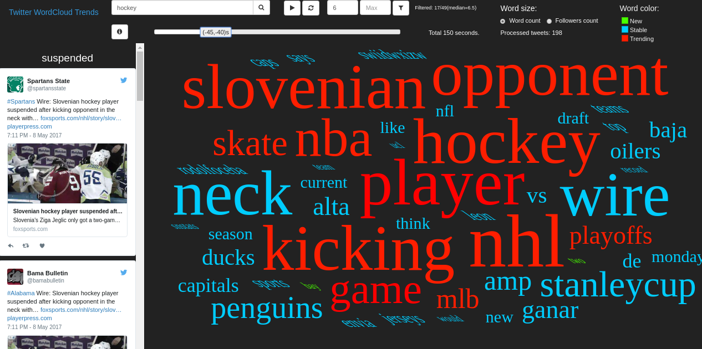

# Real-Time Twitter Word Cloud Trends Visualisation

## Features
- Search for a topic on Twitter (stream of tweets are real-time processed and the values are computed since search has started).
- Change word size mapping to word count or mean followers count of word authors. 
- Interact with word cloud by panning and zooming.
- Move up to 50 seconds back in time by moving the timeline slider.

## Use cases
- Find current trends about a topic on Twitter.
- Discover credibility of words' authors by mean followers count of a word
- See total tweets count in a topic and compare change in word usage during a time.

## Technologies


## Preview


## Install
- `pip install -r requirements.txt`
- docker-compose
- Spark (pyspark) - `spark-2.0.2-bin-hadoop2.7`
- Redis


## Getting started
1. Create new [developer app](https://apps.twitter.com/) and create `config/config.json` file with 
your configuration following `config/config-example.json` format.
    - consumer_key, consumer_secret, access_token, access_token_secret - from Twitter apps
    - docker_kafka_ip - ip address of docker container with Kafka, same as `KAFKA_ADVERTISED_HOST_NAME` 
    in `docker-compose.yml` (see logs in docker container for IP address, e.g. `Established session 0x15bec44028b0001 
    with negotiated timeout 30000 for client /172.19.0.2:37602` )
2. Start docker compose containers.
`sudo docker-compose up`
3. Set Spark directory path.
`export SPARK_HOME = <path_to_spark_home_directory>`
4. Run web application.
`python webapp/app.py`

Other useful commands:
```
# Clear container
sudo docker-compose rm
# Run docker containers
sudo docker-compose up
# In case you need to stop containers
sudo docker-compose stop

# Test connection with Kafkacat - producing to topic 'tweets' (writing to console)
kafkacat -b 172.18.0.2 -t tweets -P

# Test connection with Kafkacat - consumer from topic 'tweets'
kafkacat -b 172.18.0.2 -t tweets -C

# Run spark job processing (start automatically by web app)
$SPARK_HOME/bin/spark-submit
--jars jar/spark-streaming-kafka-0-8-assembly_2.11-2.0.2.jar 
--master local[*]
processing/trending_words.py

# Clear redis
redis-cli flushall

# Delete Spark checkpointing
rm -rf checkpoint-tweet

# Run web app for visualization using D3.js
python webapp/app.py
```
